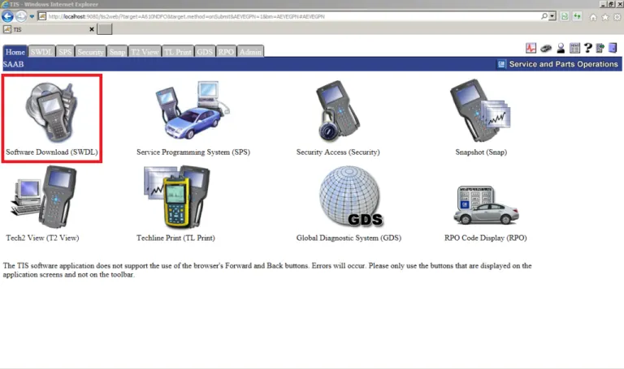
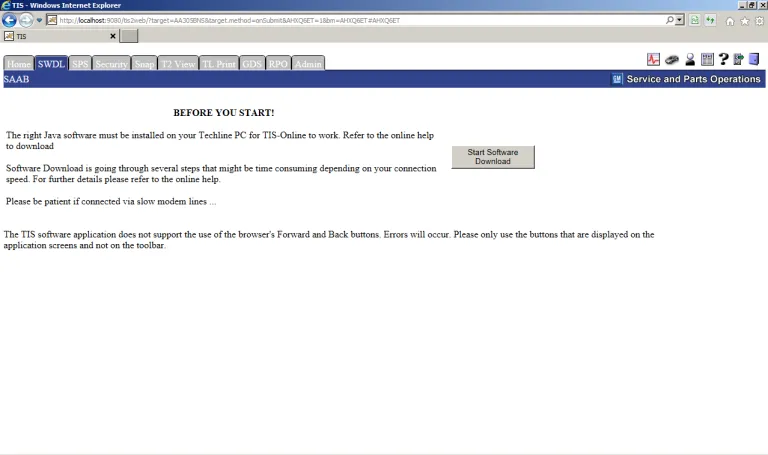
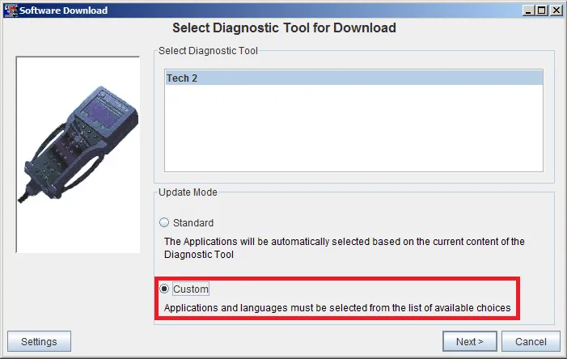
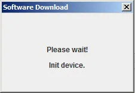
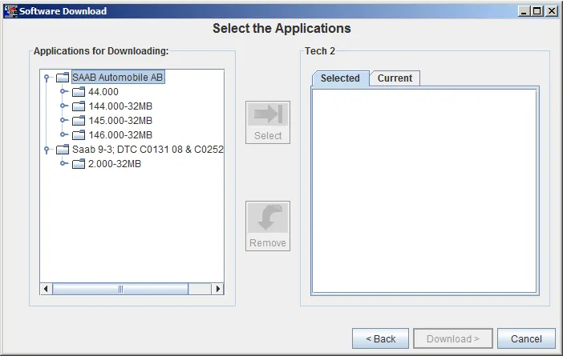
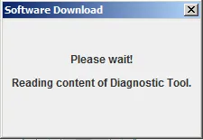
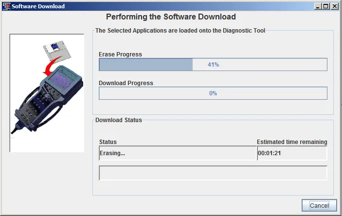
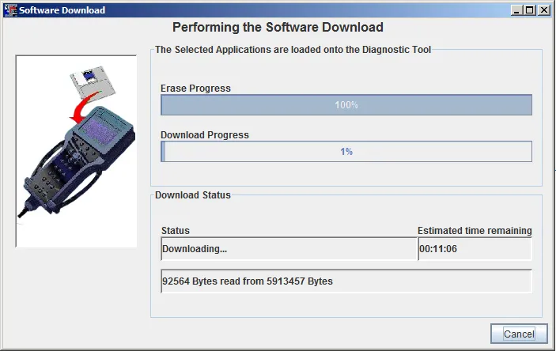

# Writing PCMCIA using GlobalTIS

GlobalTIS is a computer-based system used for reprogramming software as well as troubleshouting and diagnostics on vehicle control units. GlobalTIS is used through your web browser and requires a compatible version of Java to be able to work correctly. The system requires a hand-held, programmable diagnostic tool, Tech2, in order to communicate with the vehicle.

GlobalTIS can be used to download new software to your PCMCIA card used in the Tech2, the process takes around 15 minutes for a 32MB card.

## Requirements

*   Tech2
*   12V DC adapter as power source for the Tech2
*   PCMCIA card inserted to Tech2
*   COM port, this can be a physical DB9 or a USB to Serial cable, on a desktop/laptop computer.
*   Microsoft Windows
*   Java
*   GlobalTIS

## Preparations

Install GlobalTIS and make sure that your Tech2 can communicate with your computer.

## Writing a PCMCIA card

Make sure that your Tech2 is connected to a reliable power source.

Connect your Tech2 with a serial cable to a serial port on your computer.

Power up the Tech2 and wait for it to boot to the welcome screen.

Start GlobalTIS.

On the start screen/homepage of GlobalTIS, click on `Software Download (SWDL)`.

_Note:_ The start screen of GlobalTIS may look different depending on the version you are running.

The following information page will displayed, press `Start Software Download`.

_Note:_ Depending on the version of Java you are running you may get a warning message regarding using an outdated program. If so, click `Allow`.

In the next step you will be prompted to select the diagnostic tool and update mode you want to use. For update mode you have two options to choose between;

*   Standard
    *   This will check the current software on your PCMCIA card and then download the latest version, if any newer version is available. 

*   Custom
    *   Enables to select the version you want and also the language.

Select `Custom` and press `Next`.

GlobalTIS will now establish communication with the Tech2 initiate the device to test the connection, you will see the following message for a short while:

When the initiation is finished you will see the software versions available in your installed version of GlobalTIS. To see the available languages, double-click on a folder of a software version to expand them.

Mark the software version and language you wish to write to your PCMCIA card and then press `Select`. 

The software version you have chosen will now be displayed on the right side of the Software Download window. When the selected version and language is the one you wish to write to the PCMCIA card, press `Download >`.

GlobalTIS will now establish communication with the Tech2 and initiate the device again.

Then GlobalTIS will read the content of the PCMCIA card inserted to the Tech2.

GlobalTIS will now start to erase the content on the PCMCIA card.

During the process the Tech2 will show the following screen:

When the erasing process is finished GlobalTIS will start to download/write the new software to the PCMCIA card.

When the downloading/writing process is finished you will see the following screen:

The new software have now been written to your PCMCIA card, you can click `Close` and disconnect the Tech2 from your computer.